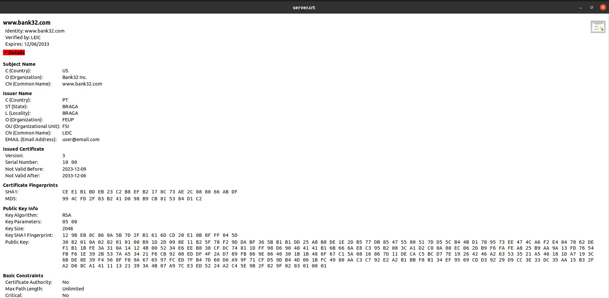
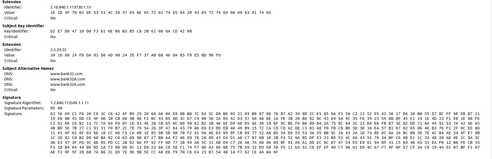

# Semana 11

## SEED Labs - SQL Injection Lab

### TASK 1

Para iniciar a execução da primeira tarefa, começamos por copiar o arquivo de configuração padrão do certificado, localizado em ```/usr/lib/ssl/openssl.cnf``` para uma pasta localizada no ambiente de trabalho. De seguida criamos a nossa _CA_:

```bash
mkdir demoCA
cd demoCA
mkdir certs
mkdir crl
mkdir newcerts
touch index.txt
echo 1000 >> serial
```

Após a execução destes comando podemos prosseguir para a configuração da nossa _CA_ com os seguintes dados (PEM pass phrase: 1234):
```bash
[12/08/23]seed@VM:~/.../PKI$ openssl req -x509 -newkey rsa:4096 -sha256 -days 3650 -keyout ca.key -out ca.crt
Generating a RSA private key
..............++++
.............................................++++
writing new private key to 'ca.key'
Enter PEM pass phrase:
Verifying - Enter PEM pass phrase:
-----
You are about to be asked to enter information that will be incorporated
into your certificate request.
What you are about to enter is what is called a Distinguished Name or a DN.
There are quite a few fields but you can leave some blank
For some fields there will be a default value,
If you enter '.', the field will be left blank.
-----
Country Name (2 letter code) [AU]:PT
State or Province Name (full name) [Some-State]:BRAGA
Locality Name (eg, city) []:BRAGA
Organization Name (eg, company) [Internet Widgits Pty Ltd]:FEUP
Organizational Unit Name (eg, section) []:FSI 
Common Name (e.g. server FQDN or YOUR name) []:LEIC
Email Address []:user@email.com
```
O conteúdo criptografico gerado foi o seguinte:

```
RSA Private-Key: (4096 bit, 2 primes)
modulus:
    00:be:4c:18:49:4e:c1:d3:97:31:94:62:0a:2b:99:
    d6:e2:4f:c6:42:b8:36:16:d4:4b:9e:d6:78:09:a6:
    6c:3a:08:e6:03:a9:26:fd:14:9d:33:54:b4:9b:14:
    bb:43:a2:6a:99:4d:35:85:9f:b9:a1:9f:7d:3d:6c:
    d9:c1:a6:38:b1:4f:f7:c1:c3:d1:6e:d6:e3:7c:d2:
    9d:a2:7d:20:2d:c4:94:5e:99:de:c6:bb:c0:d4:22:
    4e:89:84:28:3b:75:1d:97:fa:6c:20:03:a1:b4:de:
    6f:3c:b9:f1:eb:1b:34:2b:63:2f:b3:70:90:c9:fd:
    ea:21:76:14:99:28:61:a2:a8:ad:1b:fb:a7:34:0e:
    62:08:ff:53:32:56:6e:29:3e:1d:31:b1:a0:a2:a0:
    9a:39:ee:61:29:8e:dd:e0:6c:65:81:b0:19:76:f0:
    ed:80:24:1f:d6:a9:11:a5:59:39:16:3c:88:27:1d:
    5a:57:66:a7:bd:72:43:25:b4:7d:53:9b:fa:d7:c4:
    52:19:ef:59:82:5c:38:ee:27:64:f0:09:af:64:8e:
    bf:e0:31:9e:a2:66:ce:16:c7:cc:86:c3:fe:87:50:
    67:ca:96:db:e0:15:83:48:26:bf:77:e3:1b:d1:37:
    56:2d:55:f9:eb:23:4b:7a:04:57:73:39:82:90:5f:
    99:a3:fa:bb:54:30:9d:00:27:95:fc:44:66:1b:7e:
    ac:1a:18:f6:66:e6:f2:b8:95:07:c1:f8:bd:0e:7a:
    3a:7b:93:cf:55:52:a7:3d:03:84:f3:c6:fc:b4:aa:
    6d:70:c8:ad:7b:d7:27:10:08:68:3d:54:87:f3:01:
    96:4c:6d:cc:8d:05:fb:95:6c:5b:3d:c2:65:57:01:
    50:ce:b1:63:d5:75:7b:8b:61:ba:ad:52:24:5f:e8:
    36:89:e3:36:de:ac:37:7a:e2:cf:d6:73:d4:b7:51:
    37:9a:30:81:d7:9d:ee:5d:b7:e5:c0:99:b4:34:41:
    ec:4d:0a:57:f8:a3:04:99:87:1b:3d:26:59:31:2e:
    75:8c:65:e2:78:70:e4:e7:a0:69:ca:f7:e1:12:8e:
    4a:3f:9e:29:8b:6a:2a:72:eb:96:86:be:d3:9b:45:
    a4:4c:8a:44:5c:91:a3:86:ac:ab:aa:a4:35:3e:eb:
    74:6f:58:89:b0:f2:70:47:d6:4a:47:da:e2:39:ef:
    c7:73:17:a7:4a:fb:3b:b9:e4:73:5e:ac:54:27:91:
    d9:01:70:ff:69:84:6b:d8:46:73:bd:cf:ce:71:91:
    14:46:82:39:c2:17:f9:bf:e4:d5:e4:01:90:f1:66:
    ba:81:ef:c8:89:d9:b2:92:17:1f:a3:cb:c7:e0:b4:
    f3:03:6d
publicExponent: 65537 (0x10001)
privateExponent:
    00:aa:b3:4f:c5:d2:a4:03:cd:c8:67:b6:5a:31:2a:
    5a:9b:bf:bb:b4:f5:d1:6f:41:18:64:6f:36:56:51:
    b7:1b:88:07:ec:98:bb:a4:a1:ed:31:b2:76:1f:f6:
    c4:d4:b2:c8:b4:a3:91:b3:3f:c8:20:b7:14:7d:19:
    3b:6c:7e:52:b4:9b:6b:3f:a1:0c:29:45:11:e3:52:
    7a:9c:db:69:16:25:14:82:97:bc:42:c1:01:04:49:
    91:f1:c1:5e:e5:96:f4:e8:f3:76:32:71:8f:88:d3:
    4f:2d:46:0f:40:3a:b2:dd:88:a7:ad:6a:f8:36:79:
    52:a0:99:6f:78:c3:c4:71:48:a5:a0:48:69:80:44:
    b6:a4:23:84:d9:ce:b6:1a:c0:e1:27:46:93:35:ce:
    a3:09:fc:4f:a4:1b:c7:e4:1c:d8:21:31:7a:66:3b:
    50:90:75:d7:29:93:97:84:9f:38:9a:3d:ca:54:6b:
    fc:32:12:9f:bd:4c:d5:f6:e8:a4:d3:6f:43:e0:70:
    f6:c4:d4:f3:92:00:70:01:11:cd:75:94:fa:84:55:
    98:c0:df:41:d1:a4:2e:92:38:bf:ba:d3:ed:6a:2c:
    32:2e:84:8c:cf:c1:fc:75:a8:6c:70:7a:84:e5:73:
    a2:16:20:dd:82:93:b2:8c:cd:80:34:98:0e:0a:bb:
    f6:f0:99:53:6c:d4:e4:27:84:27:27:28:96:aa:9d:
    31:5d:9a:05:26:62:b9:cb:de:bc:fd:25:00:83:d1:
    60:c3:04:48:1a:b7:c7:7a:9a:fb:2a:b0:bb:67:7d:
    a0:45:b0:06:76:46:99:bc:e9:13:71:30:a9:d1:cb:
    73:b4:19:0e:2f:00:b5:e7:8b:c8:31:bc:b3:b0:9b:
    f6:a4:b4:69:6d:bf:d9:0b:ca:3d:e2:3f:98:aa:41:
    80:9c:6d:19:b9:6f:14:45:f5:74:72:a0:45:04:78:
    df:c6:c1:c5:ee:d7:34:df:46:1e:86:73:c3:6a:be:
    ec:ec:0c:4f:dd:c1:44:c6:98:7b:c4:b8:ec:53:5c:
    95:0d:91:1c:e0:67:45:75:b0:16:a1:6a:04:a2:03:
    e3:9d:8f:ba:f0:04:1a:d2:a3:29:d0:85:a7:b9:91:
    f2:00:70:47:2d:38:09:9f:3a:c5:36:dc:0a:b1:68:
    98:4c:47:e8:26:7c:9c:52:3b:d6:32:9d:84:25:f2:
    b3:7a:4a:d1:12:b8:4c:48:ac:0d:fa:49:d5:59:e4:
    3f:e6:d3:38:fa:cc:42:8c:0b:1f:06:7b:79:67:18:
    d0:9c:52:ca:c3:0c:da:dd:2e:43:5b:29:4c:d6:f2:
    3e:5e:a6:f0:85:58:95:dc:cc:36:e6:89:ee:31:61:
    49:9d:81
prime1:
    00:e1:75:24:ee:c1:bd:d3:d9:66:ea:39:51:0b:01:
    3f:a5:ac:24:02:39:f1:67:d6:96:30:44:26:46:81:
    19:68:e7:27:4c:43:ef:8d:f2:c1:65:11:c7:db:6b:
    41:fb:13:e1:da:7f:02:f0:dd:5a:6e:1e:5f:d6:62:
    cd:04:c9:c5:50:8c:f5:48:5f:02:69:41:c5:ca:7d:
    c5:f1:d8:6b:59:59:ba:1d:8e:52:08:93:f4:c5:b0:
    0f:6c:a1:87:5e:7c:e1:4b:41:39:cc:4d:5f:5a:c2:
    2a:00:2c:66:5d:10:38:6d:27:f6:05:ef:94:c5:d0:
    d0:fe:fb:a7:2c:8e:3f:9c:5b:00:c2:37:61:9e:12:
    75:52:12:7f:db:11:c5:6a:c8:40:f6:a8:48:4d:d0:
    55:51:24:fa:b6:9d:c7:5f:ea:30:c4:21:7d:00:96:
    b0:44:51:24:66:e1:02:bd:cd:a4:a1:e4:c5:95:58:
    13:c5:eb:12:f4:db:bc:c7:e3:0c:48:4d:5d:7e:55:
    d0:9a:a7:2a:41:5a:60:01:db:8f:cf:24:3b:40:08:
    69:9a:cd:34:41:93:c7:bf:87:71:10:35:06:76:98:
    90:08:70:e8:3b:d2:2a:d6:82:fa:9c:83:88:1f:5d:
    c5:42:b4:ae:46:70:2f:d3:2e:33:e3:5d:fa:93:17:
    5b:b9
prime2:
    00:d8:13:97:81:76:f1:ad:91:db:d8:9b:a9:c6:79:
    a2:42:c8:f1:c6:a3:a3:58:24:74:bd:98:8d:8c:3e:
    17:ec:e2:28:47:00:44:95:20:2f:70:6f:83:8b:44:
    d8:b3:bb:9c:1f:f2:41:94:41:f1:f2:fe:2d:d2:7f:
    e1:3f:29:61:19:dd:05:e4:68:a7:cf:36:7e:d6:d1:
    14:94:5a:d3:27:ca:53:67:36:48:73:95:14:1e:b2:
    ba:fd:cb:41:fa:d8:1a:38:63:a3:dc:d0:41:19:f4:
    e4:23:1c:2f:5f:1f:fe:8a:46:bb:b5:91:bb:89:2c:
    35:f6:dc:01:1f:a3:2b:70:5b:ac:6c:8e:dd:ee:2a:
    a5:10:51:6b:3b:ba:60:b3:4d:e3:88:7c:33:17:77:
    47:5a:7a:ec:d9:79:83:e4:74:13:4d:b1:a6:bc:90:
    41:a2:7f:10:f1:a6:48:7b:61:6b:f4:44:ac:e1:80:
    f6:98:bf:c1:11:71:4b:0a:e2:01:53:88:25:de:01:
    df:87:bb:aa:96:74:91:77:55:eb:c7:92:87:d3:3e:
    79:21:b4:cd:a6:7d:50:10:02:c7:b6:59:be:13:5c:
    3f:ff:5f:06:85:d1:f1:a5:dc:d7:bf:35:ec:f7:7e:
    1b:64:6d:b3:82:00:41:d2:b4:e5:52:8f:17:2a:eb:
    87:55
exponent1:
    00:a1:04:3d:b5:3a:ae:ec:de:e6:2e:3f:73:0e:cd:
    fc:7b:c0:be:12:cc:f9:08:b4:eb:9c:5a:ff:8e:f8:
    e2:81:d6:1c:6d:ce:53:06:e8:a9:90:1a:2b:c7:1c:
    0a:0a:5b:ff:c0:41:57:83:58:43:1e:44:19:24:0e:
    79:e7:82:86:a5:e9:95:bf:f3:02:d0:d3:85:84:01:
    61:5e:40:b7:22:1f:ff:d8:dd:ec:de:6d:74:b1:be:
    f4:b5:1b:83:87:4a:de:c8:15:34:47:21:b7:09:25:
    84:43:8d:72:29:e2:cc:b9:c0:81:67:69:dc:b1:8e:
    59:c4:d1:4b:6a:79:c9:1a:4c:af:f5:05:02:75:97:
    2f:2c:c7:43:82:dc:65:46:c6:f0:06:78:d6:f2:a3:
    e8:5a:c4:73:3d:fa:df:0a:34:42:51:c0:ac:fa:bf:
    a3:f1:96:95:cd:d7:c3:52:74:cc:b0:46:a7:89:ea:
    56:6c:d2:5f:3e:7a:b4:8f:79:2b:2b:73:fd:62:9d:
    bd:16:c6:6e:5a:30:46:42:ed:60:fe:8a:1c:ba:b5:
    87:5e:64:51:7e:c8:21:2f:3b:76:d7:21:57:95:59:
    8d:fc:49:4e:c2:72:6d:df:b7:b9:6e:10:4e:26:40:
    9d:01:ef:f2:4b:22:12:35:db:58:79:78:83:dd:8b:
    20:19
exponent2:
    00:a5:6c:aa:6b:45:a2:d5:5d:7b:d0:a3:ac:20:f5:
    72:52:6b:01:1f:30:9c:97:98:a1:7f:9d:d1:90:72:
    e1:62:4b:ea:c6:20:e0:60:c3:19:4e:9d:31:3a:68:
    64:f7:85:44:8b:f8:ae:58:50:fc:69:2a:4b:ee:82:
    54:f2:44:3d:c0:cd:43:fb:90:5c:18:fa:01:b5:78:
    b0:a6:bb:ba:39:16:5f:2f:ff:91:0c:5c:2f:e1:28:
    b8:9c:21:06:cc:82:b1:e0:45:f8:67:cf:50:68:0c:
    e2:b4:36:99:d5:db:ea:c5:f6:4d:33:3e:f5:32:99:
    94:5f:00:24:24:12:89:e9:25:66:26:5e:62:6e:3a:
    5b:d0:d8:64:9e:7f:9c:14:ea:26:ae:91:57:94:39:
    8f:79:27:ef:38:b8:1d:4f:c3:c6:1b:8f:4c:b5:c4:
    43:5b:a2:a8:58:39:13:f8:d1:a7:12:85:99:4d:b3:
    ac:17:59:86:f8:51:a2:40:1c:b3:23:3e:72:af:3b:
    03:e5:28:b9:fb:22:17:54:23:85:b5:6e:eb:69:c0:
    c4:80:17:a9:f2:32:b2:1e:ef:e1:f2:2b:56:a7:ff:
    d2:47:32:7b:0d:ec:a3:72:76:56:fe:5e:cc:a2:d5:
    fb:26:b2:0d:e2:13:4c:51:82:88:a6:e2:41:bc:6c:
    41:59
coefficient:
    00:91:42:68:5c:b3:c2:cc:7f:30:1b:1b:6a:8c:02:
    c1:77:44:eb:55:87:c7:18:76:4f:80:44:1f:13:f6:
    f9:b3:5e:a5:ba:04:ab:ec:e2:5d:fc:37:a3:bf:7d:
    7f:65:94:4f:43:97:ec:7b:8a:33:56:6f:6e:6b:0d:
    77:08:b3:fb:3b:f6:a9:72:b0:7e:47:d7:bf:5c:c3:
    50:1c:93:7c:3d:37:71:9e:fb:2c:13:2a:02:14:83:
    32:04:4b:c4:3e:3a:24:7f:f6:58:d1:00:30:d6:86:
    cf:0c:be:34:f3:c2:02:d5:cc:d5:fb:98:86:27:e1:
    b0:3e:3d:51:08:09:65:15:39:5a:59:b7:9d:2d:06:
    ff:65:26:de:c7:41:1c:ee:36:55:9a:44:7b:33:dc:
    cc:95:d2:9d:49:d1:71:4d:aa:df:f5:07:2a:97:77:
    34:85:d2:26:98:ad:b8:5a:6e:84:45:91:92:18:c6:
    3b:ac:d3:aa:aa:cd:04:46:4b:55:da:4d:b6:01:f3:
    b6:7d:5a:81:a4:1d:fd:31:7a:64:1f:1a:3a:e3:11:
    58:5a:98:73:83:c5:41:40:c2:e0:82:04:e9:bf:b0:
    a7:1e:fe:5d:75:89:eb:30:6b:e6:be:2e:ca:81:5d:
    f3:d8:77:59:95:e9:0c:2b:a0:7c:33:04:6d:78:5b:
    32:7e
```
Como podemos observar é possivel a identificaçao de certos elementos como por exemplo:
> Os dois numeros primos (_prime1_, _prime2_);
> O _modulus_;
> Os expoentes tanto publicos como privados (_publicExpoent_, _privateExpoent_);
> E o coeficiente (_coeficient_).

### Task 2

Para o incio da realização desta tarefa começamos por criar um certificado para o site ```www.bank32.com``` atraves do seguinte comando:
```bash
    openssl req -newkey rsa:2048 -sha256 -keyout server.key -out server.csr -subj "/CN=www.bank32.com/O=Bank32 Inc./C=US" -passout pass:1234 -addext "subjectAltName = DNS:www.bank32.com, DNS:www.bank32A.com, DNS:www.bank32A.com"
```

Certificado do site:

```bash
[12/08/23]seed@VM:~/.../PKI$ openssl req -in server.csr -text -noout
Certificate Request:
    Data:
        Version: 1 (0x0)
        Subject: CN = www.bank32.com, O = Bank32 Inc., C = US
        Subject Public Key Info:
            Public Key Algorithm: rsaEncryption
                RSA Public-Key: (2048 bit)
                Modulus:
                    00:d0:59:5e:b7:fc:e9:7f:17:bc:d7:83:a6:a6:b8:
                    d1:e5:1f:da:15:ef:1c:45:19:da:12:ec:be:9a:c7:
                    56:0f:58:08:64:e8:5b:1c:c0:80:76:99:f9:21:4e:
                    20:8e:73:73:0f:d3:1e:4e:40:05:4a:90:74:a6:22:
                    35:b1:0f:42:dc:c3:78:45:c8:2c:b1:74:27:e8:7b:
                    3e:b2:78:3a:1a:cd:9f:97:13:61:a7:86:1e:0e:4e:
                    dd:15:85:08:bc:19:e4:d5:4c:a1:a8:eb:35:d8:03:
                    9e:99:87:e5:61:2f:68:96:a9:a3:28:80:3c:2a:fc:
                    f6:7d:9f:c7:5c:e6:e8:55:43:57:04:33:94:66:aa:
                    3b:f6:ad:d0:a3:11:40:fe:a0:b3:c0:c3:9c:90:1a:
                    0e:42:bc:60:94:a4:a0:12:3c:a7:f9:6a:18:bf:cf:
                    f5:11:f1:27:fa:f6:3c:4d:3f:c3:77:87:22:02:d3:
                    01:e5:89:21:08:93:3e:f2:c9:ac:1a:80:f2:e0:13:
                    b8:a0:51:03:d5:29:96:d9:55:30:96:c8:ac:22:10:
                    00:8a:97:a9:69:1d:92:67:2e:79:3b:ad:07:8d:15:
                    9e:e3:2b:75:d0:61:ac:07:86:f9:73:75:30:b5:22:
                    ab:d3:0f:e7:e5:9a:9e:25:8b:a1:17:46:96:cb:14:
                    6b:e5
                Exponent: 65537 (0x10001)
        Attributes:
        Requested Extensions:
            X509v3 Subject Alternative Name: 
                DNS:www.bank32.com, DNS:www.bank32A.com, DNS:www.bank32A.com
    Signature Algorithm: sha256WithRSAEncryption
         73:dd:69:d0:a3:b8:83:d2:73:50:22:44:90:bb:c6:35:a3:d8:
         09:80:99:3b:32:0b:2c:da:50:a1:f8:5e:d3:2b:15:c9:b7:60:
         8a:de:73:12:fb:e0:90:b2:52:3f:68:05:45:17:9e:a0:d0:e4:
         cb:22:6d:9b:3c:d0:f0:b5:40:76:c2:c6:01:d4:6d:aa:81:2e:
         80:69:d7:a1:3a:67:26:7c:15:c0:b0:04:d8:af:4b:40:f3:3a:
         0d:ea:13:cf:d7:0e:51:30:0a:21:fe:be:73:9b:6c:a9:b2:e0:
         43:9a:a1:55:91:d2:01:77:00:e9:54:2e:70:19:f7:6c:e1:b1:
         26:f4:c7:69:d8:14:b9:49:90:f5:8f:0c:3f:48:ef:59:bc:a9:
         13:2c:c0:77:f1:7f:d7:15:9e:64:89:06:ad:b7:68:e4:b0:37:
         e0:19:26:30:a4:43:dd:e3:5b:dc:72:ac:fb:53:b0:d7:5c:7c:
         f7:5f:42:94:c1:9a:29:30:9f:53:ee:5d:6b:1a:d7:b4:2f:d6:
         91:eb:40:f3:28:b1:59:09:40:c6:b0:0a:d9:a4:48:ad:f3:ed:
         46:75:44:bc:07:ab:5a:24:fc:bd:bc:6d:8c:79:aa:64:5e:24:
         c6:41:43:2a:f8:79:9d:39:b7:63:37:c5:75:a7:e2:47:f1:06:
         39:07:f6:60
```

RSA do site:
```bash
[12/08/23]seed@VM:~/.../PKI$ openssl rsa -in server.key -text -noout
Enter pass phrase for server.key:
RSA Private-Key: (2048 bit, 2 primes)
modulus:
    00:d0:59:5e:b7:fc:e9:7f:17:bc:d7:83:a6:a6:b8:
    d1:e5:1f:da:15:ef:1c:45:19:da:12:ec:be:9a:c7:
    56:0f:58:08:64:e8:5b:1c:c0:80:76:99:f9:21:4e:
    20:8e:73:73:0f:d3:1e:4e:40:05:4a:90:74:a6:22:
    35:b1:0f:42:dc:c3:78:45:c8:2c:b1:74:27:e8:7b:
    3e:b2:78:3a:1a:cd:9f:97:13:61:a7:86:1e:0e:4e:
    dd:15:85:08:bc:19:e4:d5:4c:a1:a8:eb:35:d8:03:
    9e:99:87:e5:61:2f:68:96:a9:a3:28:80:3c:2a:fc:
    f6:7d:9f:c7:5c:e6:e8:55:43:57:04:33:94:66:aa:
    3b:f6:ad:d0:a3:11:40:fe:a0:b3:c0:c3:9c:90:1a:
    0e:42:bc:60:94:a4:a0:12:3c:a7:f9:6a:18:bf:cf:
    f5:11:f1:27:fa:f6:3c:4d:3f:c3:77:87:22:02:d3:
    01:e5:89:21:08:93:3e:f2:c9:ac:1a:80:f2:e0:13:
    b8:a0:51:03:d5:29:96:d9:55:30:96:c8:ac:22:10:
    00:8a:97:a9:69:1d:92:67:2e:79:3b:ad:07:8d:15:
    9e:e3:2b:75:d0:61:ac:07:86:f9:73:75:30:b5:22:
    ab:d3:0f:e7:e5:9a:9e:25:8b:a1:17:46:96:cb:14:
    6b:e5
publicExponent: 65537 (0x10001)
privateExponent:
    78:25:e1:72:56:7d:cc:55:c3:07:c1:1a:bc:70:3e:
    52:54:10:ee:af:29:ed:4b:60:2f:a3:a8:b3:17:1a:
    b0:d4:82:5a:b6:87:bc:47:e2:8d:02:73:e1:59:ed:
    7a:58:67:55:0b:d9:21:24:d8:28:4c:af:88:12:98:
    45:d7:d8:25:f8:ef:05:c6:ce:c7:32:85:c5:12:35:
    70:b3:d6:46:18:a7:dc:76:47:cd:54:91:46:8d:01:
    ff:63:ed:4a:93:e0:1b:85:0a:80:9f:cb:38:1b:b6:
    3d:31:59:fc:b6:5b:28:ef:00:70:dd:aa:54:db:f5:
    c5:31:fb:c4:be:3f:e2:d2:5c:da:78:e4:21:84:b0:
    37:12:fa:86:78:56:0a:af:4a:b7:60:d4:ec:eb:5d:
    21:b7:34:dc:b3:c5:c1:12:a9:2d:85:ec:45:a8:31:
    f4:2e:60:d0:6f:d0:c4:97:12:96:c1:ad:d2:9e:9b:
    70:7a:d4:3d:4c:22:9e:ba:dc:34:e7:7f:ba:e6:fb:
    03:87:52:eb:5a:b6:1c:e0:5a:9a:a1:7f:d2:ca:5d:
    4b:c4:0a:78:06:8b:9b:d1:6a:cc:ad:c7:f7:dd:e9:
    cc:dd:c4:38:65:0d:ce:e4:c4:eb:d0:72:56:7b:f6:
    96:5f:52:95:cd:bc:1e:ad:3c:da:2f:fb:50:a5:a1:
    81
prime1:
    00:f1:b8:34:fa:d1:16:5f:dd:8b:fe:99:4c:d8:31:
    20:98:36:4c:69:a3:17:59:ab:23:19:dc:54:02:df:
    34:6c:7e:f3:77:fe:32:a0:3f:d7:67:bd:c0:e3:16:
    30:7b:3b:7a:79:71:e6:b6:1b:8e:e9:6b:a9:f7:13:
    a6:4d:b5:57:e9:0c:8b:39:98:88:dc:c1:8c:52:c4:
    9e:34:2e:48:c5:64:86:53:61:a7:b6:d7:42:ff:4b:
    b1:75:80:26:73:38:a4:19:1f:1c:ed:cd:d6:22:42:
    5c:3f:de:eb:95:50:77:0e:c3:b6:03:e6:31:c2:0b:
    3a:e1:27:c3:18:d0:76:fc:61
prime2:
    00:dc:a8:76:f0:29:d9:66:9a:3b:45:a9:b2:39:a6:
    8c:95:04:40:f7:5f:6e:3e:b8:c6:33:db:11:11:06:
    4b:a9:c9:99:ae:f6:b4:38:f1:b7:d9:9f:1e:59:aa:
    8a:1d:b0:9a:78:36:8e:f4:18:74:c6:c4:b0:de:9d:
    89:ba:27:62:c2:89:67:40:52:8a:95:44:6a:33:ca:
    f9:01:a1:7f:fc:7e:e4:99:89:16:98:cf:79:74:88:
    f7:22:59:63:fd:01:c1:d7:4d:88:63:eb:19:6b:69:
    1f:13:49:a6:bd:65:dc:4a:04:b5:cf:81:9b:03:58:
    d9:22:ac:6d:79:5a:e2:3e:05
exponent1:
    00:cb:e9:2f:98:5f:06:56:fc:d8:7a:80:ec:58:7c:
    a9:18:7e:c5:db:5f:9f:f5:1e:ef:cf:83:14:c4:0f:
    73:74:0b:6c:6c:4f:5e:79:dd:21:63:fc:a9:59:68:
    80:a1:94:bd:6e:f1:ed:44:b6:de:ca:7e:ee:b4:e6:
    38:a6:d9:52:3d:e1:3d:19:eb:59:99:91:15:45:45:
    64:88:74:7b:23:39:f8:2f:22:f4:8e:c3:ed:5a:dc:
    89:e9:ab:9f:c4:17:86:27:43:1d:ee:66:74:3c:16:
    6b:27:de:70:32:57:dc:f7:f1:95:fc:98:16:65:b1:
    7f:8c:2d:34:e2:1c:0a:24:41
exponent2:
    5e:66:dc:6b:a7:1b:d1:5f:8e:98:21:1f:94:b6:82:
    52:86:7d:5c:d7:c1:0c:a8:74:73:5e:f7:90:37:07:
    4b:de:6a:17:86:88:58:0c:61:c1:82:e7:b3:28:d8:
    ea:16:d2:1f:38:08:34:b9:f9:cb:c7:fe:7b:5f:1e:
    bb:3b:7a:6f:0b:e5:d6:88:f9:ad:1e:95:e9:0e:9f:
    35:69:68:9e:17:93:a9:74:12:ec:d1:66:7e:ca:d2:
    20:29:ea:33:25:fb:4e:27:67:80:87:e6:5a:23:a1:
    1d:d9:56:b2:94:cf:88:03:37:dd:4c:ef:8a:a1:0a:
    54:61:3c:7c:bc:bb:2a:19
coefficient:
    00:c5:96:2e:bb:3c:62:e2:12:81:32:e8:50:94:07:
    77:02:b2:07:3a:f2:dc:6c:d8:ce:c3:a0:ec:30:00:
    7d:27:5f:8a:cf:d0:67:e7:ca:9a:ec:eb:35:11:91:
    ff:3e:69:33:bb:91:5f:b1:79:ea:e0:6b:70:46:09:
    5b:bf:6e:66:18:09:3e:ae:e3:4e:35:42:58:a9:60:
    1e:fe:b9:8c:7b:dc:92:5d:2f:7a:34:a2:b6:17:94:
    e3:9e:e2:24:71:65:d2:fc:13:32:73:ac:77:8c:7b:
    ef:dd:87:ae:ef:0e:c8:8d:f7:62:37:82:4e:4d:59:
    18:a0:b6:a6:cc:a2:08:0f:0d
```
### TASK 3


Para esta tarefa, onde o objetivo é gerar um certificado para o nosso servidor (```www.bank32.com```), executaremos o código apropriado para alcançar esse fim:
```bash
openssl ca -config openssl.cnf -policy policy_anything -md sha256 -days 3650 -in server.csr -out server.crt -batch -cert ca.crt -keyfile ca.key
```
O conteúdo encontrado no arquivo ```server.crt```  confirma que este é, de fato, um certificado para o nosso servidor:





Para verificar a abrangência deste certificado, descomentamos a linha ```copy_extensions=copy``` e, em seguida, executamos o código apropriado para essa finalidade:

```bash
openssl x509 -in server.crt -text -noout
```
Dessa forma, podemos confirmar que o certificado abrange todos os nomes de domínio especificados anteriormente na Tarefa 2 (```www.bank32.com```, ```www.bank32A.com``` e ```www.bank32A.com```):


### TASK 4

Prosseguimos então com a cópia dos arquivos _server.crt_ e _server.key_ para a pasta compartilhada volumes, renomeando-os como _bank32_. Alteramos o arquivo no _container_, localizado em ```etc/apache2/sites-available/bank32_apache_ssl.conf```, para que o certificado e a chave utilizados sejam aqueles da pasta compartilhada:


De seguida abrimos uma shell dentro do _container_ de forma a iniciar o servidor _Apache_ com o seguinte comando:

```bash
service apache2 start
```

Quando tentamos acessar o site ```https://bank32.com```, surge um aviso indicando que a conexão não é segura, pois a mesma não está criptografada:


Para tornar a conexão segura, adicionamos o certificado da Autoridade Certificadora (CA) gerado às autoridades confiáveis no navegador. Isso é feito acessando ```about:preferences#privacy``` -> Certificates -> View Certificates -> Authorities -> Import. Após essa adição, confirmamos se a conexão com o site passou a ser considerada segura:


### TASK 5

As alterações foram feitas na configuração do servidor, permitindo agora que o site www.example.com opere com as configurações que eram utilizadas anteriormente. O arquivo "etc/apache2/sites-available/bank32_apache_ssl.cnf" foi atualizado para refletir estas mudanças.


Ligamos tambem o hostname ```www.example.com``` ao IP do webserver malicioso:

```bash
sudo nano /etc/hosts #adicionar '10.9.0.80   www.example.com'
```

Após realizar o processo de rebuild no servidor e acessar o site www.example.com, observamos que o navegador emite um aviso de possível risco de segurança:


Isso ocorre devido a uma discrepância no certificado utilizado: o nome de domínio do site não corresponde ao nome presente no certificado do servidor.

### TASK 6

Assumindo que nossa Autoridade Certificadora (CA) está comprometida, ela poderia ser utilizada para gerar certificados para um site mal-intencionado. Neste caso, como nosso objetivo é criar um certificado para o site www.example.com, vamos repetir os procedimentos indicados na Tarefa 2.

```bash
$ openssl req -newkey rsa:2048 -sha256 -keyout example.key -out example.csr -subj "/CN=www.example.com/O=example Inc./C=US" -passout pass:1234
$ openssl ca -config openssl.cnf -policy policy_anything -md sha256 -days 3650 -in example.csr -out example.crt -batch -cert ca.crt -keyfile ca.key
```

Em seguida, ajustamos o arquivo de configuração do servidor, localizado em etc/apache2/sites-available/bank32_apache_ssl.conf, para que ele utilize os dois arquivos gerados: example.csr e example.key.


Ao reiniciar o site e voltar a aceder podemos observar que a ligação já é segura.


## CTF - RSA

O objetivo deste CTF era fatorizar um módulo de RSA com conhecimento partcial dos primos utilizados para o calcular e usar esse módulo para desencifrar a mensagem da flag presente no servidor.

Ao aceder ao servidor com `nc ctf-fsi.fe.up.pt 6004`, foi-nos dado o módulo (n), o expoente público (e) e o ciphertext.

``` python
e = 65537

n = 359538626972463181545861038157804946723595395788461314546860162315465351611001926265416954644815072042240227759742786715317579537628833244985694861278976928056697934064926959392075601507358866602396413033604962235604422217945253079931205430205433480758529999513833490142670671432294186322786134234472462602941

ciphertext = "6435646231366566346262656637613030633839613666366439613131323266396638623262663266633531316564336164366430643133623031343533623861303630336430376661373634303066383931323761663161343064663864616236656435666634656335646435623230306236393532643836396538663862616131663531643639646536346164393763343339333534383938316132316461306635653837643330633638363766393165333737633164363430316331656665613566666238383762643538383834363036343661376633653336636636656461303564343139396239363238323531376536363432383461363362663230303030303030303030303030303030303030303030303030303030303030303030303030303030303030303030303030303030303030303030303030303030303030303030303030303030303030303030303030303030303030303030303030303030303030303030303030303030303030303030303030303030303030303030303030303030303030303030303030303030303030303030303030303030303030303030303030303030303030303030303030303030303030303030303030303030303030303030303030303030303030303030303030303030303030303030303030303030303030303030303030303030303030303030303030303030"
```

Precisamos de descobrir os primos p e q tal que p*q = n. Com esta informação, conseguimos calcular a chave privada, decrifrar o ciphertext e obter a flag.

No enunciado do CTF é nos dada alguma informação extra sobre os valores p e q:

- p é um primo próximo de 2^512
- q é um primo próximo de 2^513

Também é nos dito que o algoritmo Miller-Rabin é útil para testar a primalidade de números. Como tal, procurámos uma implementação desse algortimo e acabamos por nos deparar com o seguinte: https://inventwithpython.com/rabinMiller.py

Agora, é só usar utilizar a função `isPrime` que obtemos no link acima e começar a testar valores em busca de `p` e `q`. Para tal, foi escolhido um intervalo arbitrário (10 000) e iremos testar todos os primos nesse raio usando 2^512 como o ponto central. Assim, obtemos valores possíveis para `p`. Agora falta testar se, para esse `p`, existe um `q` primo tal que `p*q = n`. Para isso, apenas testamos se `n` é divisível por `p` e, se for, verificamos se o resultado da sua divisão é primo. Se for, este corresponde a `q` e damos print aos resultados.

``` python
itv = 10000
p = (2**512 + 1) - itv
while p < 2**512 + itv:
    if isPrime(p):
        q, rem = divmod(n, p)
        if rem == 0 and isPrime(q):
            print(f"p = {p}")
            print(f"q = {q}")
    p += 2 
```

Ao correr este código obtemos os valores desejados:


``` python
p = 13407807929942597099574024998205846127479365820592393377723561443721764030073546976801874298166903427690031858186486050853753882811946569946433649006084381
q = 26815615859885194199148049996411692254958731641184786755447122887443528060147093953603748596333806855380063716372972101707507765623893139892867298012169761
```

Usando a função de decifração que nos é providenciada neste ctf, resta só calcular d, que sabemos que é o inverso multiplicativo de `e` módulo `phi`, em que `phi = (p-1)*(q-1)`. Assim, teremos todas as informações que precisamos para obter a flag.

``` python
def dec(y, d, n):
    int_y = int.from_bytes(unhexlify(y), "little")
    x = pow(int_y,d,n)
    return x.to_bytes(256, 'little')

phi = (p-1)*(q-1)
d = pow(e, -1, phi)
flag = dec(unhexlify(ciphertext), d, n)
print(flag.decode())   
```


