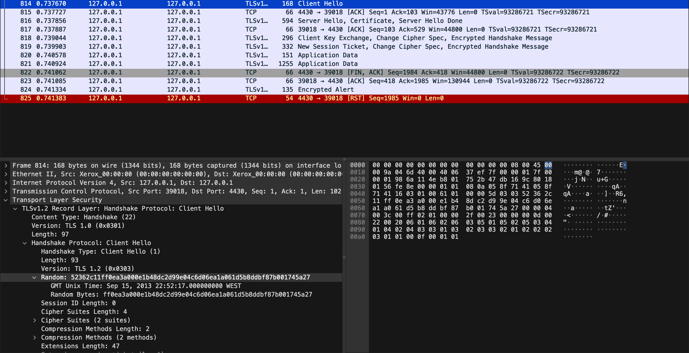

# Semana 13

## SEED LABS Packet Sniffing and Spoofing Lab


## CTF FIND-MY-TLS

Inicalmente, abrimos o ficheiro disponibilizado no _wireshark_ e analisamos os seus frames. Conseguimos perceber que o frame _814_ é o ```frame_start``` do procedimento e handshake do TLS.



Assim a primeira parte da flag foi descoberta ficando ```flag{814-<frame_end>-<selected_cipher_suite>-<total_encrypted_appdata_exchanged>-<size_of_encrypted_message>}```.

Posteriormente, de forma a facilitar a análise selecionamos no frame 814 a opção _Follow > TCP Stream_ resultando na visualização do frame 814 ao 825.

Localizamos na mensagem _Encrypted Handshake Message_ o ```frame_end``` no frame 819:


Ficando assim a flag: ```flag{814-819-<selected_cipher_suite>-<total_encrypted_appdata_exchanged>-<size_of_encrypted_message>}```.

Em relação à terceira parte da flag, conseguimos encontrar a _Cipher Suite_ usada no frame 816:


Passando a flag a ```flag{814-819-TLS_RSA_WITH_AES_128_CBC_SHA256-<total_encrypted_appdata_exchanged>-<size_of_encrypted_message>}```.

Para a parte da flag ```total_encrypted_appdata_exchanged``` precisamos de somar todos os frames marcados com _Application Data_. Estes frames correspondem ao 820 e 821 e obtivemos os valores 80 e 1184, respetivamente.


Para a última parte da flag fomos ao frame 819 procurar o tamanho da mensagem encriptada, _Length = 80_.


A flag ficou então: 

```flag{814-819-TLS_RSA_WITH_AES_128_CBC_SHA256-1264-80}```