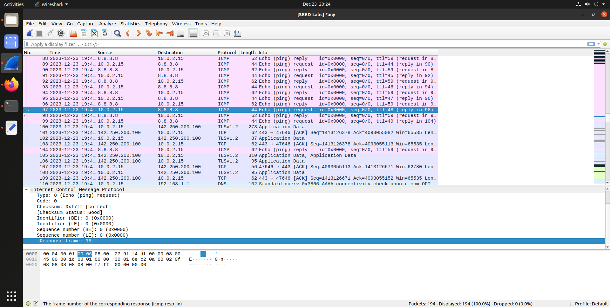
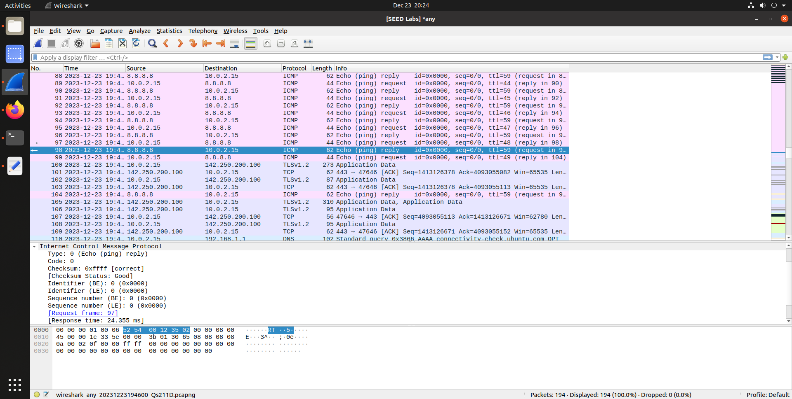
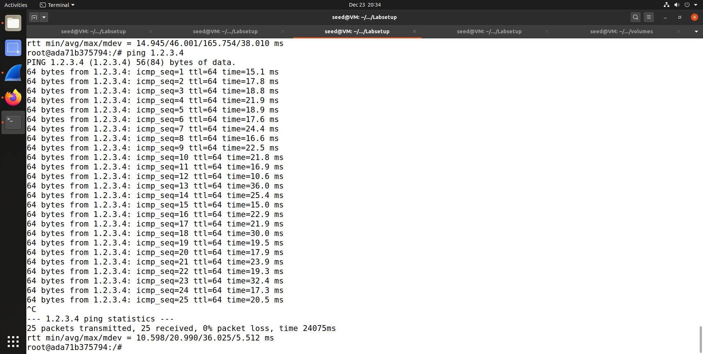
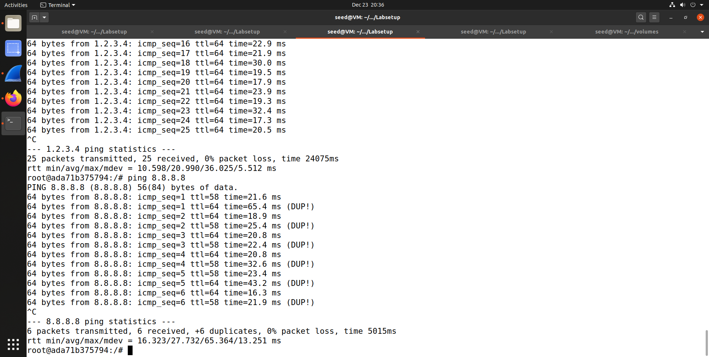

# Semana 13

## SEED LABS Packet Sniffing and Spoofing Lab

### TASK1

#### Task 1.1: Sniffing Packets

##### Task 1.1A
Nesta tarefa é nos pedido para capturar os pacotes após a utilização do código `sniffer.py` no terminal do atacante:

Primeiramente é necessário obter o iface que pretendemos atacar:

 

```python
#!/usr/bin/env python3
from scapy.all import *

def print_pkt(pkt):
	pkt.show()
pkt = sniff(iface=’br-a9932627838c’, filter=’icmp’, prn=print_pkt) 

```


E ao dar ping a partir do host A para o B são obtidos os seguintes resultados:

```bash
###[ ICMP ]### 
        type      = echo-request
        code      = 0
        chksum    = 0xa2de
        id        = 0x1d
        seq       = 0x7
###[ Raw ]### 
           load      = '.s\x87e\x00\x00\x00\x00\xdeQ\x02\x00\x00\x00\x00\x00\x10\x11\x12\x13\x14\x15\x16\x17\x18\x19\x1a\x1b\x1c\x1d\x1e\x1f !"#$%&\'()*+,-./01234567'

###[ Ethernet ]### 
  dst       = 02:42:0a:09:00:05
  src       = 02:42:0a:09:00:06
  type      = IPv4
###[ IP ]### 
     version   = 4
     ihl       = 5
     tos       = 0x0
     len       = 84
     id        = 47662
     flags     = 
     frag      = 0
     ttl       = 64
     proto     = icmp
     chksum    = 0xac5e
     src       = 10.9.0.6
     dst       = 10.9.0.5
     \options   \
###[ ICMP ]### 
        type      = echo-reply
        code      = 0
        chksum    = 0xaade
        id        = 0x1d
        seq       = 0x7
###[ Raw ]### 
           load      = '.s\x87e\x00\x00\x00\x00\xdeQ\x02\x00\x00\x00\x00\x00\x10\x11\x12\x13\x14\x15\x16\x17\x18\x19\x1a\x1b\x1c\x1d\x1e\x1f !"#$%&\'()*+,-./01234567'
```

##### Task 1.1B

Aqui é pretendido capturar certos pacotes, tendo então de modificar o código anterior para que este filtre os pacotes que têm como destino o host B:

1. Capturar ICMP packets enviados para o host B


```python
#!/usr/bin/env python3
from scapy.all import *

def print_pkt(pkt):
	pkt.show()
pkt = sniff(iface='br-a9932627838c', filter='icmp', prn=print_pkt) 

```

Obtém-se o resultado anterior

2. Capturar TCP packets enviados para a porta 23 do host B

```python

#!/usr/bin/env python3
from scapy.all import *

def print_pkt(pkt):
	pkt.show()

pkt = sniff(iface='br-a9932627838c', filter='tcp and src host 192.168.1.100 and dst port 23', prn=print_pkt) 

```

Com o ping, não se obtém nenhum resultado.

3. Capturar apenas pacotes de um determinado subnet ao qual a nossa máquina não pertence

```python
#!/usr/bin/env python3
from scapy.all import *

def print_pkt(pkt):
	pkt.show()
pkt = sniff( iface='br-a9932627838c', filter='(net 128.230.0.0/16)', prn=print_pkt) 

```
Ao realizar o ping a 128.30.0.0 são capturados os seguintes pacotes:

```bash
##[ Ethernet ]### 
  dst       = 02:42:13:b7:91:22
  src       = 02:42:0a:09:00:05
  type      = IPv4
###[ IP ]### 
     version   = 4
     ihl       = 5
     tos       = 0x0
     len       = 84
     id        = 16733
     flags     = DF
     frag      = 0
     ttl       = 64
     proto     = icmp
     chksum    = 0x6e58
     src       = 10.9.0.5
     dst       = 128.230.0.0
     \options   \
###[ ICMP ]### 
        type      = echo-request
        code      = 0
        chksum    = 0xbfee
        id        = 0x2e
        seq       = 0x7
###[ Raw ]### 
           load      = 'Uv\x87e\x00\x00\x00\x00\x8d-\x0f\x00\x00\x00\x00\x00\x10\x11\x12\x13\x14\x15\x16\x17\x18\x19\x1a\x1b\x1c\x1d\x1e\x1f !"#$%&\'()*+,-./01234567'
```

##### Task 1.2: Spoofing ICMP Packets

Para esta tarefa é necessário usar o wireshark.

Primeiramente, criamos o ficheiro `spoofer.py` com o seguinte código:

```python
from scapy.all import *
a = IP() 
a.dst = '10.9.0.6'
b = ICMP() 
p = a/b 
send(p)
```

Obtendo o seguinte resultado:


##### Task 1.3: Traceroute

O objetivo desta tarefa é determinar a distanância, em termos de routers, entre a nossa máquina e um determinado host.

O comando `traceroute` do `Scappy` permite enviar pacotes ICMP com TTL. Ao enviar um pacote com TTL=1, o pacote é descartado pelo primeiro router e este envia um pacote ICMP de volta para a nossa máquina. Ao enviar um pacote com TTL=2, o pacote é descartado pelo segundo router e este envia um pacote ICMP de volta para a nossa máquina. Este processo é repetido até o pacote chegar ao host.


Ao correr o seguinte código:

```python
from scapy.all import *

for i in range(1, 50):
    a = IP()
    a.dst='8.8.8.8'
    a.ttl=i
    b= ICMP()
    a.show()
    b.show()
    send(a/b)

```

Verificamos no wireshark que foi necessário saltar 10 routers para chegar ao destino.


#### Task 1.4: Sniffing and Spoofing

O objetivo desta tarefa é capturar os pacotes ICMP enviados pelo host A para o host B e enviar uma resposta ICMP para o host A.

Além disso, é necessário ter em conta os pacotes ARP.
Para perceber mais um bocado sobre os pacotes ARP, podemos usar o wireshark.


Nestas imagens podemos ver a estrutura de um pacote ARP. O campo `hwsrc` corresponde ao endereço MAC do host que envia o pacote e o campo `hwdst` corresponde ao endereço MAC do host que recebe o pacote.

O campo `psrc` corresponde ao endereço IP do host que envia o pacote e o campo `pdst` corresponde ao endereço IP do host que recebe o pacote.

O campo `op` corresponde ao tipo de operação que está a ser realizada. O valor 1 corresponde a um pedido ARP e o valor 2 corresponde a uma resposta ARP..

O campo `hwlen` corresponde ao tamanho do endereço MAC. O valor 6 corresponde a um endereço MAC de 6 bytes.

o campo `plen` corresponde ao tamanho do endereço IP. O valor 4 corresponde a um endereço IP de 4 bytes.

O nosso objetivo com os pacotes ARP é simular a resposta ARP, caso o pedido ARP exista.

Para tal será necessário os valores anteriormente referidos.

```python

    if pkt.haslayer(ARP) and pkt[ARP].op == 1:
        arp = ARP(hwlen=6, plen=4, op=2, pdst=pkt[ARP].psrc, hwdst=pkt[ARP].hwsrc, psrc=pkt[ARP].pdst)
        send(arp)
```

Além disso, é necessário também conhecer mais sobre os pacotes ICMP.




O campo `type` corresponde ao tipo de pacote ICMP. O valor 8 corresponde a um pedido ICMP e o valor 0 corresponde a uma resposta ICMP.

O campo `code` corresponde ao código do pacote ICMP. O valor 0 corresponde a um pedido ICMP e o valor 0 corresponde a uma resposta ICMP.

Portanto o nosso objetivo com os pacotes ICMP é simular a resposta ICMP, caso o pedido ICMP exista.

Para tal será necessário os valores anteriormente referidos.

```python

    if pkt.haslayer(ICMP) and pkt[ICMP].type == 8:
        ip=IP(src=pkt[IP].dst, dst=pkt[IP].src)
        icmp = ICMP(type=0, code=0, id=pkt[ICMP].id, seq=pkt[ICMP].seq)
        data = pkt[Raw].load
        spoof_pkt = ip/icmp/data
        send(spoof_pkt)

```

E por fim, para dar sniff às mensagens ICMP, é necessário usar o seguinte código:

```python

pkt = sniff(iface='br-a9932627838c', filter='icmp', prn=spoff_sniff_pkt) 

```

Para o ping a um host B não existente, o resultado é o seguinte:



O que o nosso programa faz é enviar uma resposta ICMP para o host A com o objetivo de simular que o host B existe.


Para o ping a um host B existente, o resultado é o seguinte:



Como o host existe, os pacotes recebidos são duplicados pois o host A recebe a resposta ICMP do host B e a resposta ICMP do nosso programa.


Para o ping a um host B não existente na LAN, o resultado é o seguinte:

Infelizmente não conseguimos obter o resultado pretendido. O nosso programa não consegue enviar um pacote ARP falso para o host A. O que nos permitiria obter o endereço MAC do host A e assim enviar uma resposta ICMP para o host A.


## CTF FIND-MY-TLS

Inicalmente, abrimos o ficheiro disponibilizado no _wireshark_ e analisamos os seus frames. Conseguimos perceber que o frame _814_ é o ```frame_start``` do procedimento e handshake do TLS.


Assim a primeira parte da flag foi descoberta ficando ```flag{814-<frame_end>-<selected_cipher_suite>-<total_encrypted_appdata_exchanged>-<size_of_encrypted_message>}```.

Posteriormente, de forma a facilitar a análise selecionamos no frame 814 a opção _Follow > TCP Stream_ resultando na visualização do frame 814 ao 825.

Localizamos na mensagem _Encrypted Handshake Message_ o ```frame_end``` no frame 819:


Ficando assim a flag: ```flag{814-819-<selected_cipher_suite>-<total_encrypted_appdata_exchanged>-<size_of_encrypted_message>}```.

Em relação à terceira parte da flag, conseguimos encontrar a _Cipher Suite_ usada no frame 816:


Passando a flag a ```flag{814-819-TLS_RSA_WITH_AES_128_CBC_SHA256-<total_encrypted_appdata_exchanged>-<size_of_encrypted_message>}```.

Para a parte da flag ```total_encrypted_appdata_exchanged``` precisamos de somar todos os frames marcados com _Application Data_. Estes frames correspondem ao 820 e 821 e obtivemos os valores 80 e 1184, respetivamente.


Para a última parte da flag fomos ao frame 819 procurar o tamanho da mensagem encriptada, _Length = 80_.


A flag ficou então: 

```flag{814-819-TLS_RSA_WITH_AES_128_CBC_SHA256-1264-80}```