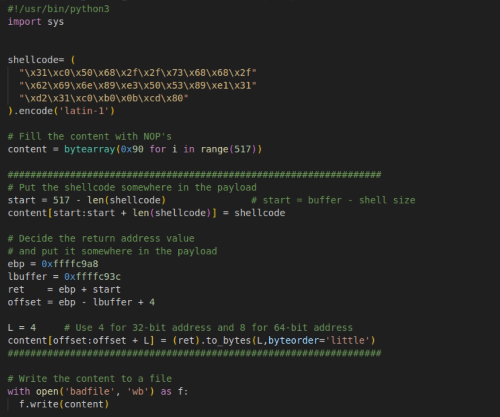
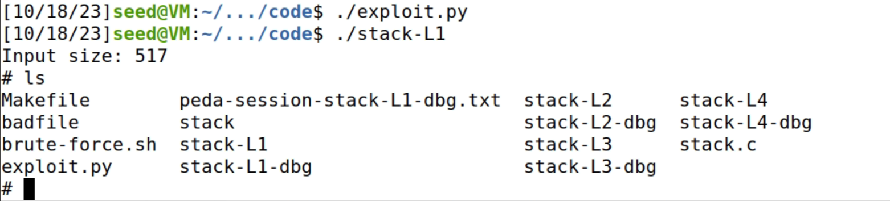
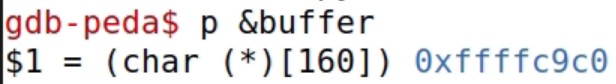
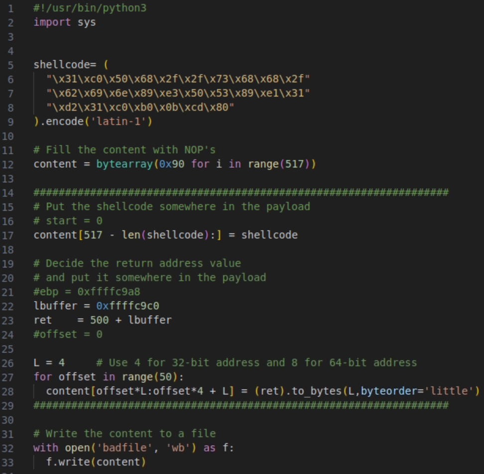
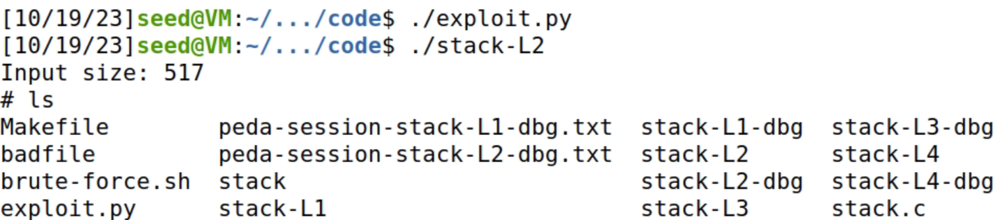

# Semana 5

## SEED Labs – Buffer-Overflow Attack (Set-UID)

### Task 1

Depois de compilar o ficheiro call_shellcode.c com a makefile, podemos verificar que ambos os programas (32-bit e 64-bit) abrem a shell corretamente.


### Task 2

Compilámos o ficheiro stack.c usando a makefile, que tornou o programa compilado em um programa Set-UID.


### Task 3

Criámos um ficheiro vazio chamado ```badfile```. Posteriormente, iniciamos a depuração através do GDB, colocando um breakpoint na função ```bop``` no ficheiro ```stack-L1-dbg```, com o objetivo de encontrar a posição do endereço de retorno da função ```bof``` em relação ao início do buffer.


Concluímos o debug do ficheiro através do comando ```next``` para posteriormente obtermos os valores ```ebp``` e de ```buffer``` através dos comandos ```p $ebp``` e ```p &buffer``` respetivamente.


Assim obtivemos todos os endereços que precisavamos. Vamos então modificar o nosso programa em python ```exploit.py``` que altera o nosso ```badfile``` colocando o que necessitamos inserir no buffer. 
Notas: <br>
1. Alteramos a shellcode para a versão 32-bits que nos forneceram no ficheiro call_shellcode.c que executa uma shell.
2. Enchemos a variavel ```content```, de tamanho 517 bytes, com NOP's (bytes de 0x90).
3. Criámos uma variável ```ret``` através do valor ```start```, obtido através da subtração do tamanho do buffer e do tamanho do nosso shellcode, somado ao endereço obtido pelo GDB de ```ebp```. Este valor contém o endereço de retorno que aponta para a execução da shell.
4. Por final, através dos endereços ```ebp``` e ```buffer``` ambos obtidas pelo GDB calculamos o endereço de retorno em relação ao inicio do ```content```, ```offset```.



Após isto executamos o ficheiro ```exploit.py``` que dá resultado ao nosso ficheiro ```badfile```. Executamos então o programa ```stack-L1``` que resulta num trigger a um buffer overflow e invoca uma sheel com permissões root. 



### Task 4

Semelhante à task anterior começamos por executar um debug através do ```GDB``` e obtivemos o valor do endereço do ```buffer```.



Assim fizemos as alterações necessárias no nosso ficheiro ```exploit.py```: <br>
1. Trocamos a posição do shellcode para o final do badfile (```content[517 - len(shellcode):] = shellcode```).
2. O return adress também foi alterado acrescentando um valor superior a 200 ao endereço obtido do buffer. (No caso 500, após tentar com 400 e 300).
3. Como o tamanho do buffer é de 200 e cada endereço ocupa 4 bytes colocamos um loop de range 50 de forma a conseguir encontrar a verdadeira posição do return address e colocá-lo lá.



Após isso executamos os ficheiros ```exploit.py``` e ```stack-L2``` que resultou num trigger de um buffer overflow e invocou uma shell com permissões root.



## CTF - Buffer Overflow


### Desafio 1

O ```program``` (executável do main) não possui importantes características de segurança, uma vez que funciona numa arquitetura i386-32-bit, sem proteção RELRO, sem canário de pilha, sem proteção NX, sem suporte para Executáveis de Posição Independente (PIE) e possui segmentos que são tanto legíveis, escrevíveis como executáveis (RWX). Verificamos estas propriedades do ```program``` com o comando
 ```checksec program```.


 De seguida analisamos o ficheiro ```main.c```. Verificamos que o ```meme_file``` tem 8 bytes de espaço e o ```buffer```, que armazena a resposta do utilizador, possui 32 bytes de espaço.

 No entanto, notamos também que o ```scanf``` permite a cópida de 40 bytes para o ```buffer``` o que permite dar overflow ao buffer.

 Em uma stack, a memória alocada é contígua e depende da ordem em que as variáveis são declaradas. Portanto, se ultrapassarmos a capacidade do ```buffer```, acabamos por sobrescrever a área de memória reservada para ```meme_file```. Como as instruções subsequentes em ```main.c``` exibem o conteúdo de ```meme_file```, nosso objetivo é reescrever o nome do arquivo a ser lido de forma a mostrar o conteúdo de ```flag.txt```.

 Assim, é apenas necessário escrever o seguinte texto para obter a flag:

                aaaaaaaaaaaaaaaaaaaaaaaaaaaaaaaaflag.txt


 Tendo então obtido: 

                flag{6e61d0ffb5903eedeeaa1cf2ebd8ec61}

 ### Desafio 2

Fazendo ```checksec program``` novamente, notamos que tem as mesmas características do ```program``` do Desafio1.

No entanto, ao analisar o código verificamos novos segmentos de código. Existe alocação de 9 bytes para ```meme_file```. no entanto, por ter 2 ```'\0'``` é lido como se fosse apenas ```meme_file\0```. ALém disso, existe agora a variável ```val```, com 4 bytes alocados. Esta variável ```val``` é importante para a vulnerabilidade pois, apesar de dificultar o processo de exploit, é necessária para o mesmo.

É atribuído a ```val``` o seguinte valor: ```"\xef\xbe\xad\xde"```. 

Ao correr o programa pela primeira vez e sem tentar dar exploit, verificamos que o ```val= 0xdeadbeef```. Logo, podemos concluir que para esta condição se verificar 

             if(*(int*)val == 0xfefc2324)

é necessário reescrever o que está em val (0xfefc2324 = ```"\xfe\xbe\xad\xde```) para (0x2423fcfe = ```\xdeadbeef```).

Como no desafio anterior, a memória alocada é contígua, ,logo é necessário reescrever buffer, val e meme_file por essa ordem. Sendo então o input necessário:

                aaaaaaaaaaaaaaaaaaaaaaaaaaaaaaaa\x24\x23\xfc\xfeflag.txt'

Obtendo a flag:

                flag{69efacb5de4fbed521eb433ef91018c1}


