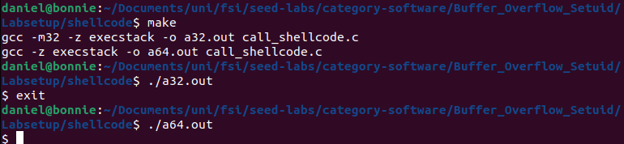
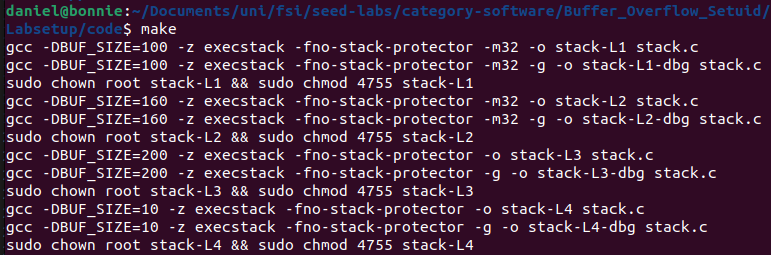
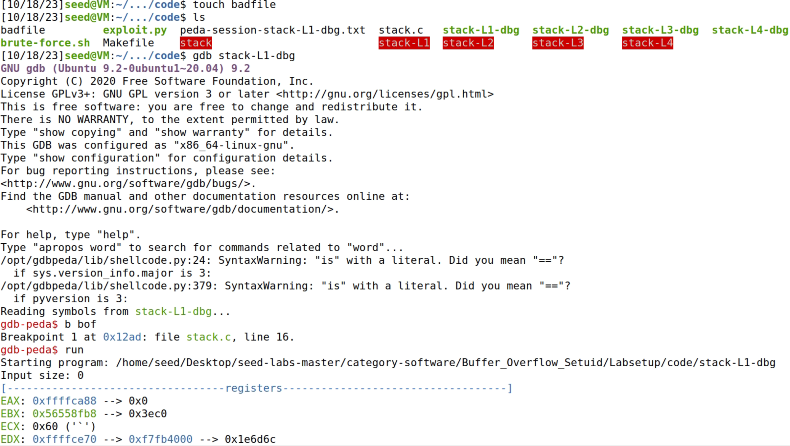

# Semana 5

## SEED Labs – Buffer-Overflow Attack (Set-UID)

### Task 1

Depois de compilar o ficheiro call_shellcode.c com a makefile, podemos verificar que ambos os programas (32-bit e 64-bit) abrem a shell corretamente.



### Task 2

Compilámos o ficheiro stack.c usando a makefile, que tornou o programa compilado em um programa Set-UID.



### Task 3

Criámos um ficheiro vazio chamado ```badfile```. Posteriormente, iniciamos a depuração através do GDB, colocando um breakpoint na função ```bop``` no ficheiro ```stack-L1-dbg```, com o objetivo de encontrar a posição do endereço de retorno da função ```bof``` em relação ao início do buffer.



Concluímos o debug do ficheiro através do comando ```next``` para posteriormente obtermos os valores ```ebp``` e de ```buffer``` através dos comandos ```p $ebp``` e ```p &buffer``` respetivamente.


Assim obtivemos todos os endereços que precisavamos. Vamos então modificar o nosso programa em python ```exploit.py``` que altera o nosso ```badfile``` colocando o que necessitamos inserir no buffer. 
Notas: <br>
1. Alteramos a shellcode para a versão 32-bits que nos forneceram no ficheiro call_shellcode.c que executa uma shell.
2. Enchemos a variavel ```content```, de tamanho 517 bytes, com NOP's (bytes de 0x90).
3. Criámos uma variável ```ret``` através do valor ```start```, obtido através da subtração do tamanho do buffer e do tamanho do nosso shellcode, somado ao endereço obtido pelo GDB de ```ebp```. Este valor contém o endereço de retorno que aponta para a execução da shell.
4. Por final, através dos endereços ```ebp``` e ```buffer``` ambos obtidas pelo GDB calculamos o endereço de retorno em relação ao inicio do ```content```, ```offset```.


Após isto executamos o ficheiro ```exploit.py``` que dá resultado ao nosso ficheiro ```badfile```. Executamos então o programa ```stack-L1``` que resulta num trigger a um buffer overflow e invoca uma sheel com permissões root. 


## CTF - Buffer Overflow