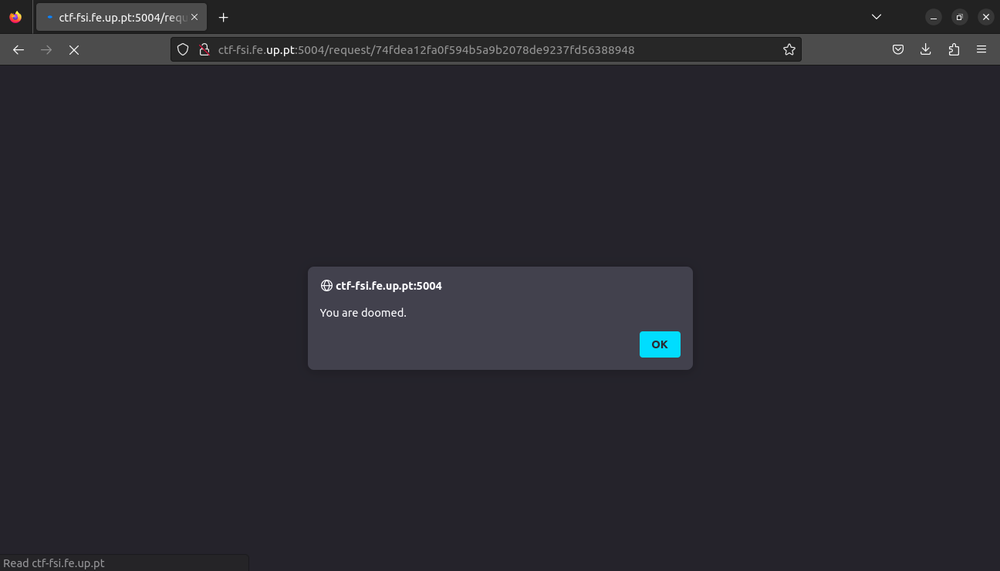
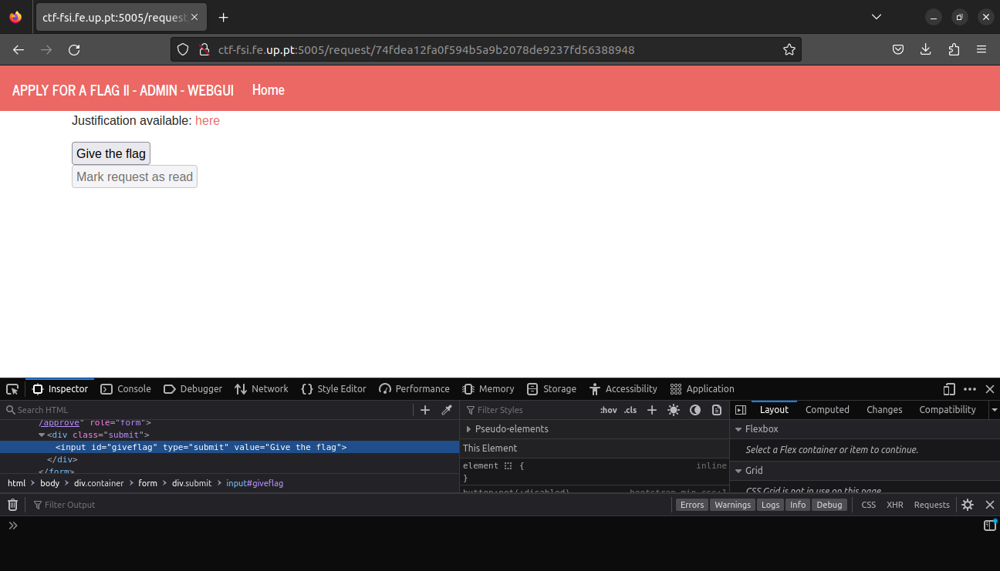
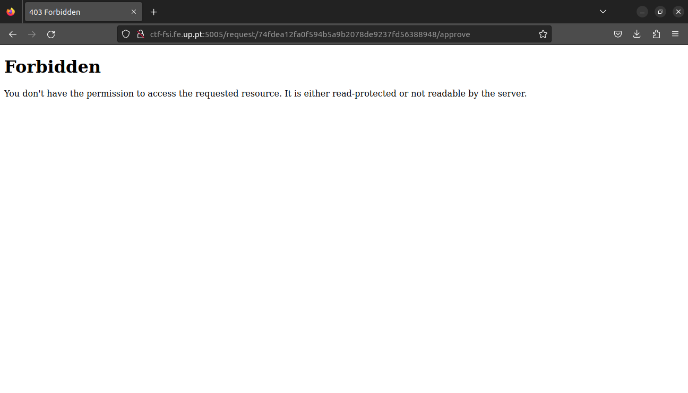
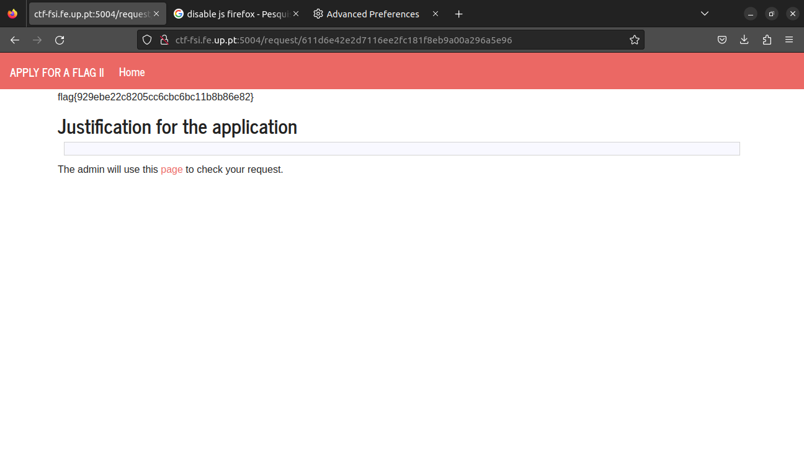

# Semana 6

## CTF - XSS + CSRF

O objetivo deste CTF era "convencer" o adminstrador de um site a dar-nos a flag, usando uma combinação de XSS com CSRF. Na página inicial do site, o utilizador possui uma caixa de texto onde pode explicar ao adminstrador porque é que ele merece a flag. Começámos então por verificar se era possível inserir código HTML nessa caixa:

```html
<script>alert('You are doomed.')</script>
```

E verificámos que o script era executado, ou seja, o site é vulnerável a ataques XSS:



A página que o adminstrador usa para aceitar ou rejeitar os pedidos da flag possui 2 botões `Give the flag` e `Mark the request as read`. Estes botões, para os utilizadores comuns, não são clicáveis, mas podemos alterar o html do site usando a ferramenta `Inspect` do browser para podermos interagir com eles.




Como utilizador comum, não temos as permissões necessárias para executar o pedido POST que concede a flag ao pedido. Porém, sabemos que, no máximo, de 2 em 2 minutos, o adminstrador abre a página para ler o pedido e decidir se dá a flag ou não. Aproveitando-nos do facto de que o site é vulnerável a ataques XSS, como verificado anteriormente, podemos incluir um script no nosso pedido que irá executar automaticamente quando o adminstrador o abrir e que executa o pedido POST em nome dele. A isto chama-se um ataque CSRF e, se correr bem, o adminstrador irá conceder a flag ao nosso pedido sem ter que fazer nada.

Vamos então criar um form que se submete por si próprio quando o admin abrir a página:

```html
<script>
  var form = document.createElement('form');
  form.method = 'POST';
  form.action = 'http://ctf-fsi.fe.up.pt:5005/request/[INSERIR AQUI O ID DO NOSSO PEDIDO]/approve';
  document.body.appendChild(form);
  form.submit();
</script>
```

Depois de esperar alguns segundos, podemos ver que o adminstrador "decidiu", finalmente, aceitar o nosso pedido:


Nota: Tivemos que desativar javascript no nosso browser temporariamente, de modo ao script não correr quando entramos na página e conseguirmos ler a flag.